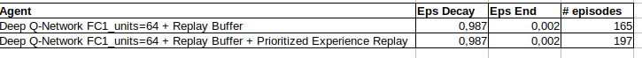
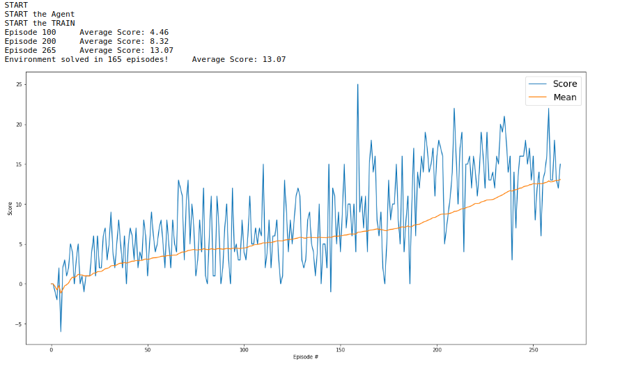

# nanodegrees_deep_RL
Udacity Deep Reinforcement Learning Nanodegree

# Train an RL Agent to Collect Bananas

# Goal
In this project, I build a reinforcement learning (RL) agent that navigates an environment that is similar to Unity's Banana Collector environment.

A reward of +1 is provided for collecting a yellow banana, and a reward of -1 is provided for collecting a blue banana. The goal of our agent is to collect as many yellow bananas as possible while avoiding blue bananas. 

# Evaluate State & Action Space

The state space has 37 dimensions and contains the agent's velocity, along with ray-based perception of objects around the agent's forward direction. Given this information, the agent has to learn how to best select actions. Four discrete actions are available, corresponding to:

0 - move forward.
1 - move backward.
2 - turn left.
3 - turn right.

The task is episodic, and in order to solve the environment, your agent must get an average score of +13 over 100 consecutive episodes.

# Getting Started
Download the environment from one of the links below. You need only select the environment that matches your operating system:

* Linux: click [here](https://s3-us-west-1.amazonaws.com/udacity-drlnd/P1/Banana/Banana_Linux.zip)
* Mac OSX: click [here](https://s3-us-west-1.amazonaws.com/udacity-drlnd/P1/Banana/Banana.app.zip)
* Windows (32-bit): click [here](https://s3-us-west-1.amazonaws.com/udacity-drlnd/P1/Banana/Banana_Windows_x86.zip)
* Windows (64-bit): click [here](https://s3-us-west-1.amazonaws.com/udacity-drlnd/P1/Banana/Banana_Windows_x86_64.zip)

(For Windows users) Check out this link if you need help with determining if your computer is running a 32-bit version or 64-bit version of the Windows operating system.

(For AWS) If you'd like to train the agent on AWS (and have not enabled a virtual screen), then please use [his link](https://support.microsoft.com/en-us/help/827218/how-to-determine-whether-a-computer-is-running-a-32-bit-version-or-64) to obtain the environment.

Also, the original Udacity repo for this project can be found [here](https://github.com/udacity/deep-reinforcement-learning/tree/master/p1_navigation).

Follow the instructions in Navigation.ipynb to get started with training your own agent!

# Learning Algorithm

1) Deep Q-Network (DQN) + Experience Replay
With Deep Q-Learning, a deep neural network is used to approximate the Q-function. Given a network F, finding an optimal policy is a matter of finding the best weights w such that F(s,a,w) ≈ Q(s,a). [original paper](https://storage.googleapis.com/deepmind-media/dqn/DQNNaturePaper.pdf)

The neural network architecture used for this project can be found in the model.py file of the source code. The network contains three fully connected layers with 64, 64, and 4 nodes respectively. Testing of bigger networks (more nodes) and deeper networks (more layers) did not produce better results.

As for the network inputs, rather than feeding-in sequential batches of experience tuples, I randomly sample from a history of experiences using an approach called Experience Replay.

Experience replay allows the RL agent to learn from past experience.

Each experience is stored in a replay buffer as the agent interacts with the environment. The replay buffer contains a collection of experience tuples with the state, action, reward, and next state (s, a, r, s'). The agent then samples from this buffer as part of the learning step. Experiences are sampled randomly, so that the data is uncorrelated. This prevents action values from oscillating or diverging catastrophically, since a naive Q-learning algorithm could otherwise become biased by correlations between sequential experience tuples.

Also, experience replay improves learning through repetition. By doing multiple passes over the data, our agent has multiple opportunities to learn from a single experience tuple. This is particularly useful for state-action pairs that occur infrequently within the environment.

The implementation of the replay buffer can be found in the dqn_agent.py file of the source code.

2) Deep Q-Network (DQN) + Experience Replay + Prioritized Experience Replay
Experience replay lets online reinforcement learning agents remember and reuse experiences from the past. [paper](https://arxiv.org/abs/1511.05952)

# Results

Performance is measured by the fewest number of episodes required to solve the environment.

With DQN+RB I was able to solve the game in 165 episodes:

# Future Improvements

1) Test the Rainbow Algorithm: [here](https://arxiv.org/abs/1710.02298)

