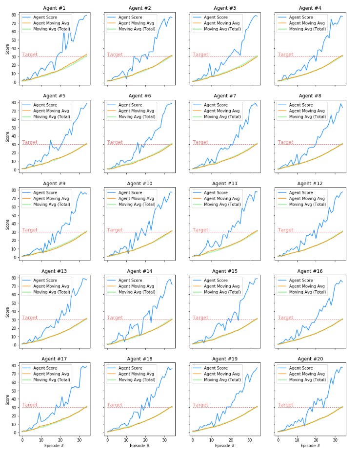

# nanodegrees_deep_RL
# Project 2: Continuous Control

## In my implementation I have chosen to solve the Second version of the environment (20 Agents) using DDPG algorithm.

### Algorithm
In order to solve this challenge, I have explored and implemented the Deep Deterministic Policy Gradient algorithm (DDPG), as described in this paper: [Continuous control with deep reinforcement learning](https://arxiv.org/abs/1509.02971).

Deep Deterministic Policy Gradient (DDPG) is an algorithm which concurrently learns a Q-function and a policy. It uses off-policy data and the Bellman equation to learn the Q-function, and uses the Q-function to learn the policy.

# Included in this repository
The code used to create and train the Agent
<pre>
1) Continuous_Control.ipynb: In this Jupyter Notebook file, you can train the agent and plot results. 
2) ddpg_agent.py: implement the DDPG agent, a Noise (Ornstein-Uhlenbeck process) and a Replay Buffer class.
3) model.py: Actor & Critic Networks.
4) checkpoint_ddpg.pt : The trained model
5) environment.yml: A file describing all the packages required to set up the environment
6) A Report.md file describing the development process and the learning algorithm, along with ideas for future work
7) This README.md file
</pre>

## Network

In model.py code I implement the Actor and the Critic class. Both Actor and Critic class implement a Target and a Local Neural Network for training.

<pre>
Actor network built: [Linear(in_features=33, out_features=400, bias=True), Linear(in_features=400, out_features=300, bias=True), Linear(in_features=300, out_features=4, bias=True)]
Actor network built: [Linear(in_features=33, out_features=400, bias=True), Linear(in_features=400, out_features=300, bias=True), Linear(in_features=300, out_features=4, bias=True)]
Critic network built: [Linear(in_features=33, out_features=400, bias=True), Linear(in_features=404, out_features=300, bias=True), Linear(in_features=300, out_features=1, bias=True)]
Critic network built: [Linear(in_features=33, out_features=400, bias=True), Linear(in_features=404, out_features=300, bias=True), Linear(in_features=300, out_features=1, bias=True)]
</pre>

fc_layers for the actor network: FC1: 400 nodes, FC2: 300 nodes.
fc_layers for the critic network: FC1: 400 nodes, FC2: 300 nodes.

### Development

For this project I tried different configurations before finding the optimal one.

One of my goals was to successfully implement PER: Prioritized Experience Replay.
I implement this in ddpg_agent_PER_slow.py, but training was very very slow. 
This is why I gave up using it, and I chose to optimize the DDPG.

### Fine-tuning the hyperparameters

I have tried many configurations:
  - Network size: i tried with [128,128] , [64,128] , [128,256] but in the end i used the layout suggested in the paper: two hidden layers, the first with 400 nodes and the second with 300 nodes, for both Actor and Critic networks.
  - BUFFER_SIZE: I start from 1e4 to 1e5 and endig with 1e6.
  - BATCH_SIZE: start from 128, try with 256, 64 and in the end used 128
  - LEARN_EVERY: learn every 10 step. Try with 1, 20, but in the end used 10.
  
The final used hyperparameters:
<pre>
BUFFER_SIZE = int(1e6)  # replay buffer size
BATCH_SIZE = 128      # minibatch size
GAMMA = 0.99            # discount factor
TAU = 1e-3              # for soft update of target parameters
LR_ACTOR = 1e-3         # learning rate of the actor 
LR_CRITIC = 1e-3        # learning rate of the critic
WEIGHT_DECAY = 0        # L2 weight decay

GRAD_CLIPPING = 1.0     # Gradient Clipping
EPSILON = 1.0     # for epsilon in the noise process (act step)
EPSILON_DECAY = 1e-6
LEARN_EVERY = 10        # Update the networks after every 10 timesteps
LEARN_NUMBER = 1 

NOISE_DECAY = 0.999
</pre>

## Result
After several attempts, and several hours of calculation, I was able to find the best configuration, which presented optimal results.
The best config, was found using max_t=2000 and using LEARN_EVERY=10, training networks after every 10 timestamp.
This solution has allowed us to significantly improve computational times and performance! With more time I would be curious to try with the PER (Prioritized Experience Replay) with these config.

With this configuration I was able to solve the problem with only 35 episodes.

All agents have successfully achieved the result:

## Ideas for Future Work

 1) use succesfully PER - Prioritized Experience Replay.
 2) test A3C - Asynchronous Advantage Actor-Critic.
