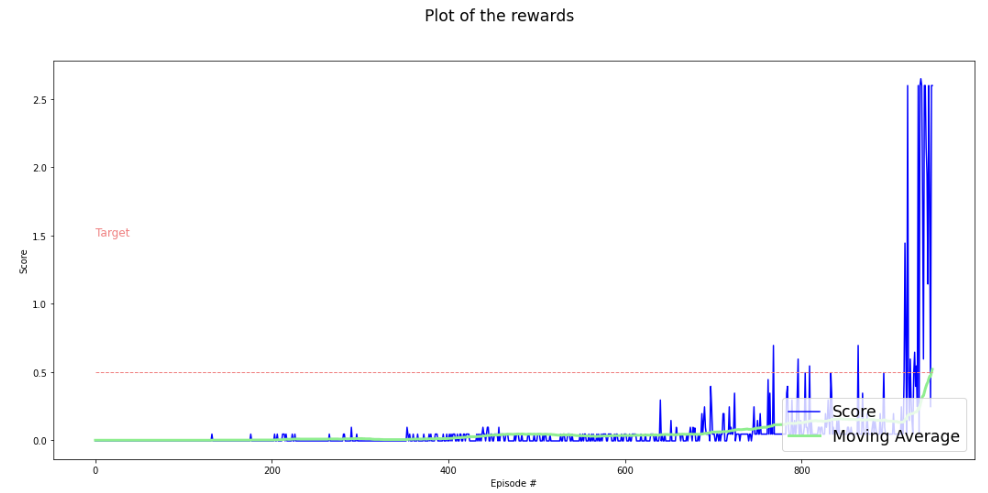
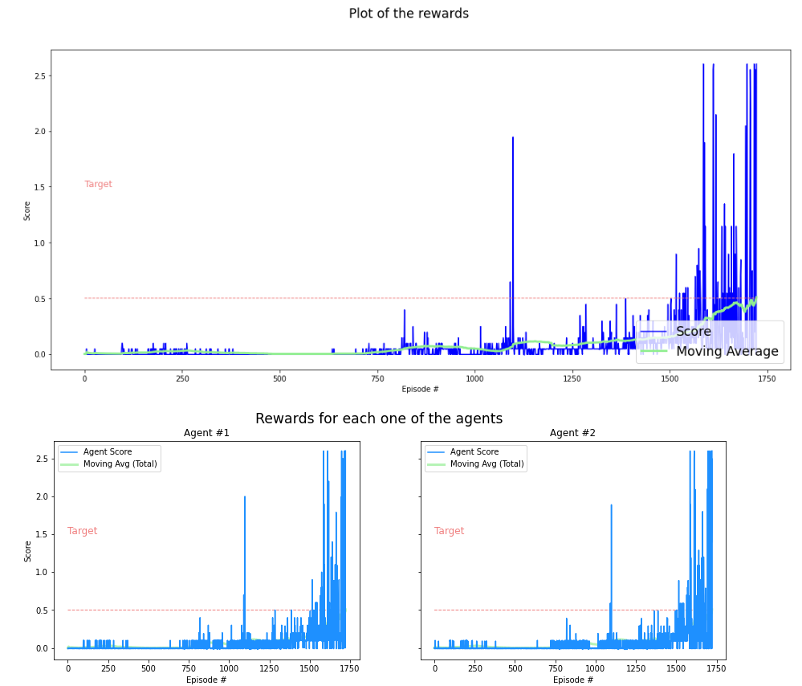

# nanodegrees_deep_RL
# Project 3: Collaboration and Competition

## In my implementation I have chosen to solve the environment using DDPG algorithm.

### Algorithm
In order to solve this challenge, I have explored and implemented the Deep Deterministic Policy Gradient algorithm (DDPG), as described in this paper: [Continuous control with deep reinforcement learning](https://arxiv.org/abs/1509.02971).

Deep Deterministic Policy Gradient (DDPG) is an algorithm which concurrently learns a Q-function and a policy. It uses off-policy data and the Bellman equation to learn the Q-function, and uses the Q-function to learn the policy.

# Included in this repository
The code used to create and train the Agent
<pre>
1) Tennis.ipynb: In this Jupyter Notebook file, you can train the agent and plot results. 
2) Tennis_500.ipnb: train the algos for 500 episodes.
3) ddpg_agent.py: implement the DDPG agent, a Noise (Ornstein-Uhlenbeck process) and a Replay Buffer class.
4) model.py: Actor & Critic Networks.
5) checkpoint_ddpg.pt : The trained model
6) checkpoint_ddpg_2.pt : model trainde for 500 episodes.
7) A Report.md file describing the development process and the learning algorithm, along with ideas for future work
8) This README.md file
</pre>

## Network

In model.py code I implement the Actor and the Critic class. Both Actor and Critic class implement a Target and a Local Neural Network for training.

<pre>
Actor network built: [Linear(in_features=24, out_features=128, bias=True), Linear(in_features=128, out_features=64, bias=True), Linear(in_features=64, out_features=2, bias=True)]
Actor network built: [Linear(in_features=24, out_features=128, bias=True), Linear(in_features=128, out_features=64, bias=True), Linear(in_features=64, out_features=2, bias=True)]
Critic network built: [Linear(in_features=24, out_features=128, bias=True), Linear(in_features=130, out_features=64, bias=True), Linear(in_features=64, out_features=1, bias=True)]
Critic network built: [Linear(in_features=24, out_features=128, bias=True), Linear(in_features=130, out_features=64, bias=True), Linear(in_features=64, out_features=1, bias=True)]
</pre>

fc_layers for the actor network: FC1: 128 nodes, FC2: 64 nodes.
fc_layers for the critic network: FC1: 128 nodes, FC2: 64 nodes.

### Development & Fine-tuning the hyperparameters
There was no need to use so many neurons. With 128-64 configuration the training process was very fast and efficient.

I have tried many configurations:
  - Network size: i tried with [400,300] , but in the end i used two hidden layers, the first with 128 nodes and the second with 64 nodes, for both Actor and Critic networks.
  - BUFFER_SIZE: I start from 1e6 and endig with 1e5.
  - BATCH_SIZE: used 128
  - LEARN_EVERY: learn every 10 step. Try with 1,5,20, but in the end used 10.
  
The final used hyperparameters:
<pre>
BUFFER_SIZE = int(1e5)  # replay buffer size
BATCH_SIZE = 128      # minibatch size
GAMMA = 0.99            # discount factor
TAU = 1e-3              # for soft update of target parameters
LR_ACTOR = 1e-3         # learning rate of the actor 
LR_CRITIC = 1e-3        # learning rate of the critic
WEIGHT_DECAY = 0        # L2 weight decay

GRAD_CLIPPING = 1.0     # Gradient Clipping
EPSILON = 1.0     # for epsilon in the noise process (act step)
EPSILON_DECAY = 1e-6
LEARN_EVERY = 10       # Update the networks 10 times after every 20 timesteps
LEARN_NUMBER = 1 

NOISE_DECAY = 0.999

</pre>

## Result

The best config, was found using max_t=2000 and using LEARN_EVERY=10, training networks after every 10 timestamp.
This solution has allowed us to significantly improve computational times and performance! In 11m16s the agent was able to solve the enviroment running on my PC with only CPU.

With this configuration I was able to solve the problem with only 131 episodes.

Tthe results after 500 episodes :

## Ideas for Future Work

 1) use succesfully PER - Prioritized Experience Replay.
 2) build a model using Alphazero or Muzero Algos.
